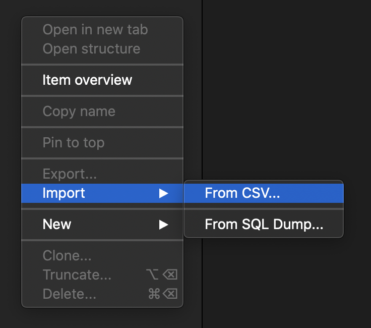
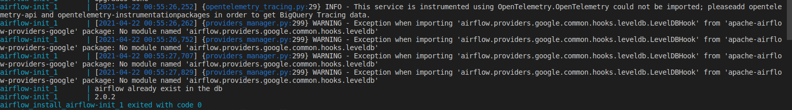
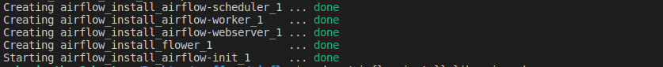
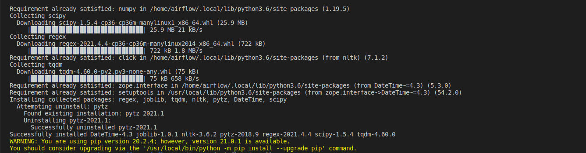
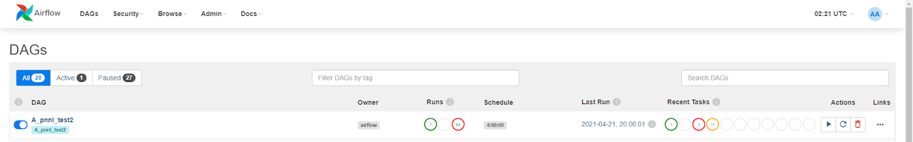
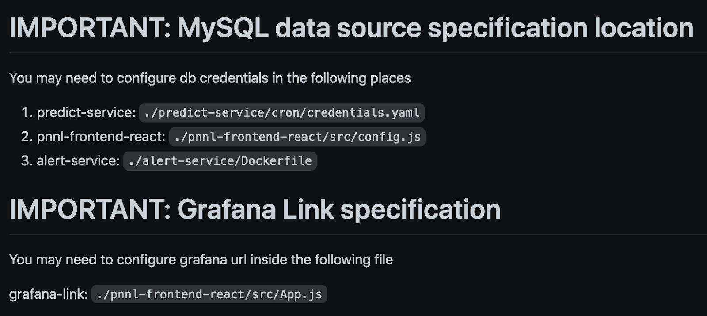

# Project Documentation

This course project was developed for Northeastern University's course, Advance Software Development, in collaboration with Pacific Northwest National Laboratory. The project's goal was to increase awareness in building data. The project's mainly focused its efforts with analyzing, transforming, and visualizing metrics within the System's Engineering Building (SEB). [The PNNL Project Organization](https://github.com/PNNL-Project/) contains all the files and links required to get the PNNL Project running.

## PNNL Organization Components

The components within PNNL Project include:  

1. **airflow-data-pipeline**: The ML data pipeline that queries MySQL daily to create predictions and store back in MySQL.
2. **data-importers**: Software programs utilized to import data into the MySQL and Influx Databases.
3. **documentation**: Overall documentation including instructions to setup the projects [(located in the devops folder)](https://github.com/PNNL-Project/documentation/tree/main/devops)
4. **grafana-services**: The Grafana dashboard files and instructions along with the Influx DB files.
5. **ml-models**: ML models and the code used to develop them.
6. **mysql-files**: Documentation and links for the database structures and the content of the tables (using mysqldump).
7. **react-app**: The 3 components that create the visualization and alerts: Hunting service, PNNL-Frontend-React, React-App-Redis-Backend (Predictions API).

## Project Flows

#### What was the flow used to create the various piechart/heatmap/stacked bar visualizations?

In order to create the visualizations, there were various steps involved:

1. Processed the SEB CSV data to import into CHISSL (data was aggregated into 1 hour windows for a particular metric for each device)
2. Used CHISSL help create a trainset to create machine learning models
3. Stored the SEB CSV data into the a denormalized table in MySQL using [TablePlus](https://docs.tableplus.com/)
4. A daily job was developed using Airflow and Python Code to do the following:
   - Reprocess SEB data from MySQL in the exact same format at step 1
   - Run the data through the machine learning model to create predictions on the yesterday's data
   - Store the predictions back into MySQL
5. A chron job queried MySQL (on an hourly basis) for the prediction labels and stores this into a redis cache
6. Upon loading the frontend react app, it queried the predictions api to retrieve the data stored into the redis cache
7. The frontend then displayed the data provided from the predictions api

#### What was the flow used to create the alert service?

In order to visualize the alerts, this also involved various steps:

1. SEB Data was imported into the MySQL database using the [DataProcessor](https://github.com/PNNL-Project/data-importers/tree/master/DataProcessor) into a normalized table
2. The alert-service queries the data from MySQL every 15 mins to find hunting events
3. Upon loading, the alerts component of the frontend-react application will visualize these alerts

#### What was the flow used to create the Grafana Dashboards?

1. SEB given was historical, so the data set was transformed (shifting the timestamp to more recent dates so the simulated data appeared to be current)
2. SEB CSV Data was parsed, processed, and imported into Influx DB
3. Queries to InfluxDB were created to be displayed into the panels

# Setup Instructions

## Database Option 1

1. Download [TablePlus](https://tableplus.com/)
2. Install MySQL
3. Use TablePlus to connect to MySQL and its database
4. On the left side, right click -> import -> from csv -> pick [this](https://drive.google.com/file/d/15-xkvpZLFWUSWN7Gx7Sp8BXG6Gz6Xkvz/view?usp=sharing) file
   
5. Create tables for predictions in MySQL database (CREATE table sql files are [here](https://drive.google.com/file/d/1S74jVp6iCu_lTN_fks38sWGGkTCXrcrw/view?usp=sharing))
6. Once this is done, you have the denormalized table. This table is used by the AirFlow service.
7. The next step is to create the normalized schema which is used by Hunting service, please refer to [this](https://github.com/PNNL-Project/mysql-files) repo.
8. InfluxDB installation and data import has been integrated into [Grafana service](https://github.com/PNNL-Project/grafana-services) So not extra setup is required at this moment.

## Database Option 2 (mysql dump)

1. Install MySQL
2. Created a database
3. Syntax for restoring a MySQL dump: \
   <code>mysql &lt; database_name &lt; file.sql</code></strong>
4. Restore the following files: \
   a) `dumpshunting_presentation-2021_04_15-dump.sql` \
   b) `Labelled_agg_tables-2021_04_21-dump.sql` \
   c) `SEB_processed_date_time_shifted-2021_04_21-dump.sql`
5. InfluxDB installation and data import has been integrated into [Grafana service](https://github.com/PNNL-Project/grafana-services) So not extra setup is required at this moment.

## Airflow

**STEPS TO INSTALL AIRFLOW**

Check out the code from

https://github.com/PNNL-Project/airflow-data-pipeline/tree/master/airflow

Please follow the instructions below

_System Tested : Ubuntu 20.0.4 Requirements : Need to have docker installed on the system_ _Please run the scripts in the airflow folder in the following order_ Please note that you need to have root access to run these scripts.

1. Run the `airflow_install_step1.sh`

Command : `sudo ./airflow_install_step1.sh`

This script will initialize the airflow containers

Please see to that the script does cause any errors

The output should be

1. Run the `airflow_install_step2.sh`

Command : `sudo ./airflow_install_step2.sh`

The script will run the docker containers and install all the services and start airflow services

The output should be

1. Run the `airflow_install_libraries.sh`

Command : `sudo ./airflow_install_libraries.sh`

This script will install the libraries.

The output should be

4.Run the following code sudo docker ps -a. This will show the list of docker services running

Trouble Shooting:

If see the DAGS are not initialized . Please follow the following steps

1. Go to airflow_install directory. You need to have root access.
2. Run the airflow.sh script

Command : `sudo ./airflow.sh bash`

In this will open the command line of the container .

run the airflow db init

This will initialize the dags

Go to `localhost:8080`

The username and password will be airflow

The console should look like

## React Web App

1. Launch Grafana service as instructed in [this](https://github.com/PNNL-Project/grafana-services) repo. Remember the url for the grafana dashboard.
2. Launch the [react app](https://github.com/PNNL-Project/react-app) via the instructions. Fill in the correct database credentials and the Grafana URL.
   
3. Now if you open `localhost:3000`, you should see the web app is up and running.
